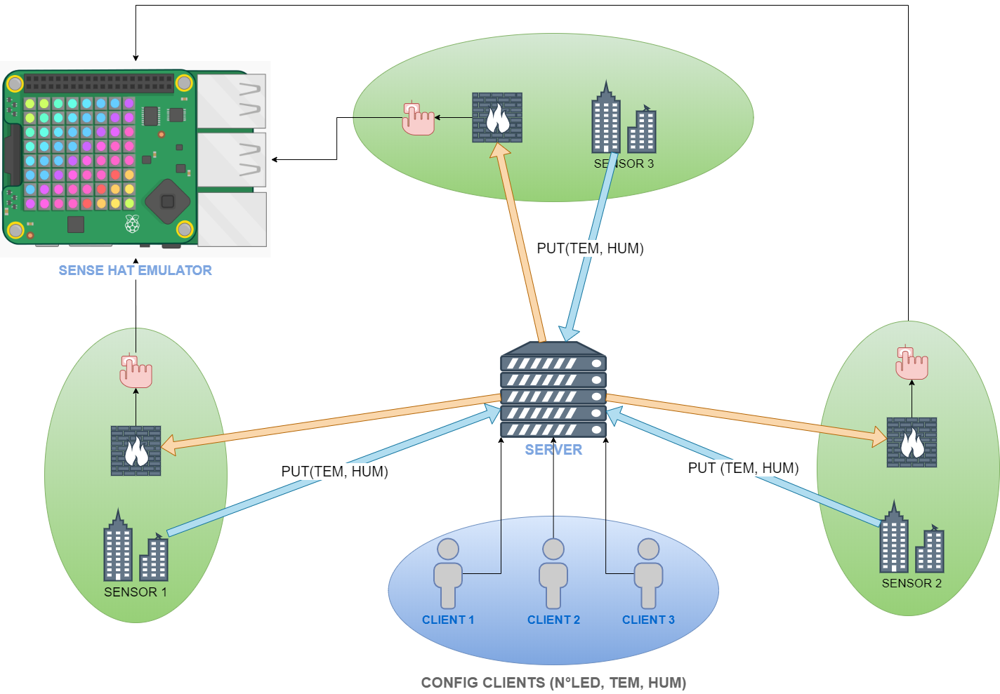
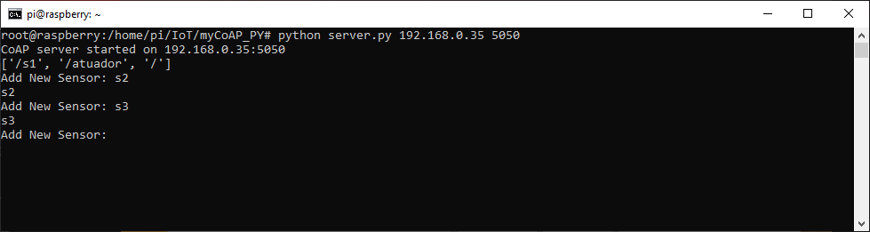
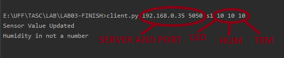
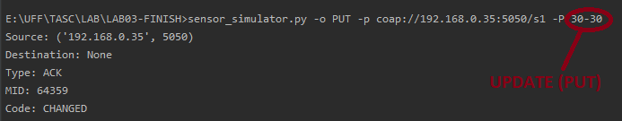

<h2>Diagrame</h2>

<h2>Requisitos</h2>

<ol>
<li>Python 2.7.16 (Versões superiores requerem não funcionam com coap)</li>
<li>CoAPthon 4.0.2 </li>
<a>sudo pip install CoAPthon</a>
<li>Sense Hat Emulator</li>
sudo apt-get install python-sense-emu python3-sense-emu sense-emu-tools
</ol>

<h2>Arquivos necessários</h2>
<ol>
  <li>Servidor
    <ul>
      <li>server.py</li>
      Inicie o servidor na máquina virtual ou no host, crie os clientes em sua forma básica sem configuração.
      <li>atuador.py</li>
      Com base nos parâmetros de configuração e nas atualizações do cliente, ele envia um sinal para o sense_emulator e, caso a temperatura e a umidade excedam os parâmetros da configuração inicial, o sense_emulator acenderá seu led na posição inicialmente configurada pelo cliente.  
    </ul>
   </li>
  <li>Cliente
    <ul>
      <li>client.py</li>
      Configure os parâmetros do cliente (#LED, Umidade, temperatura)
      <li>sensor_simulator.py</li>
      Ele simula um sensor que envia uma atualização de parâmetro através do serviço coap, no nosso caso, umidade e temperatura.
    </ul>
  </li>
</ol>

<h2>Execução</h2>
<ol>
  <li><b>Passo 1</b> 
  Execute o servidor e cree os clients 
  python server.py 192.168.0.35 5050
  
  <li><b>Passo 2</b></li>
    <ul>
      <li>Execute sense_hat</li>
      sudo sense_emu_gui
      <li>Execute atuador.py</li>
      sudo python atuador.py 192.168.0.35 5050
    </ul>    
  </li>  
  
  <li><b>Passo 3</b> 
    <ul>
    <li>Execute o client.py</li>
    </ul>
      python client.py 192.168.0.35 5050 s1 10 10 10 
      <!--python client.py 192.168.0.35 5050 s2 20 20 20 
      python client.py 192.168.0.35 5050 s3 30 30 30 -->
      
  </li>
  
  <li><b>Passo 4</b>
    <ul>
      <li>Execute sensor_simulator.py</li>
      python sensor_simulator.py -o PUT -p coap://192.168.0.35:5050/s1 -P 0-0 
      Mudar para cada cliente :5050/<b>s2 –P 0-0</b>
      
      <li>Operações (<b>PUT POST ou GET</b>)</li>
      <li>Serviço COAP (<b>coap://</b>)</li>
      <li>Endereço do servidor (<b>192.168.0.35 ou localhost<b>)</li>
      <li>Porto (<b>5050</b>)</li>
      <li>Cliente <b>s1</b></li>
      <li>Valores enviados (umidade-temperatura) (<b>30-30</b>)</li>
    </ul>
  </li>

</ol>

